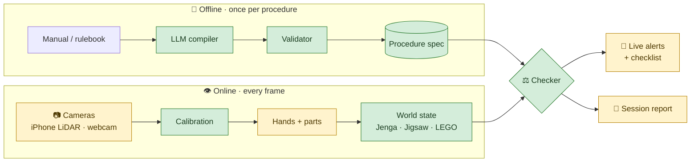

<div align="center">

# 🧩 STEPWISE

### Catch mistakes in a procedure *as they happen*, from video, with rules an LLM reads from the manual.


[How it works](#how-it-works) · [Architecture](#architecture) · [Quick start](#quick-start) · [Status](#status) · [Roadmap](#roadmap)

</div>

---

## ✨ What it does

Someone plays **Jenga** or builds a **jigsaw** in front of a camera. STEPWISE follows along and
flags the moment they break the procedure:

| 🚫 Alert | Example |
| :-- | :-- |
| **Illegal move** | Pulling a block from the top complete layer |
| **Out of order** | Filling the middle before the border is done |
| **Missed step** | Finishing with a gap nobody filled |
| **Wrong part** | Putting in a piece that belongs somewhere else |
| **Wrong position / rotation** | Right piece, wrong spot or turned the wrong way |

You don't write any rules by hand. Give it the **manual or rulebook as text**, and an LLM turns
it into the rules the checker enforces.

---

<a id="how-it-works"></a>

## 💡 How it works

<table>
<tr>
<td width="33%" valign="top">

### 📖 Read
**LLM compiler**, offline, once per procedure

Turns the manual into a *procedure spec*: what must be true before each move, and what the move
should change.

</td>
<td width="33%" valign="top">

### 👁️ Watch
**Computer vision**, every frame

Tracks hands and parts and keeps a live *world state*: which Jenga slots are full, which jigsaw
cells are filled.

</td>
<td width="33%" valign="top">

### ⚖️ Judge
**Deterministic checker**

Compares what the camera sees against the spec. Every alert comes from an explicit rule, never
from the LLM.

</td>
</tr>
</table>

> [!NOTE]
> **The LLM never sees video.** It only reads text: it compiles the manual, and later explains
> the session. All visual judgement is made by CV models, and every alert can be traced back to
> the rule that raised it.

---

## 🎯 Procedures

| | Procedure | Status | Why it's a good test |
| :-: | :-- | :-: | :-- |
| 🟫 | **Jenga** | 🟢 Active | **No step order, only rules.** Tests whether the system handles constraints, not just sequences. All blocks look alike, so any failure is a reasoning failure, not a detection one. |
| 🧩 | **Jigsaw** | 🟢 Active | **A grid of pieces.** Pieces are identified by matching against the box picture, so no training is needed. Its instructions are written as ordered steps (corners → edges → interior). |
| 🧱 | **LEGO** | ⏸️ Parked | The original demo. Code and tests are kept; set aside for now. |

### 📷 Hardware

- **Jenga:** an iPhone Pro with **LiDAR** at one corner of the tower (colour + depth), plus a
  second camera at the opposite corner. Depth makes empty and pushed-out slots easy to see even
  though every block is the same colour.
- **Jigsaw:** one overhead **webcam** above a board with printed ArUco markers at the corners.

---

<a id="architecture"></a>

## 🏗️ Architecture



<div align="center"><sub>🟩 built&nbsp;&nbsp;·&nbsp;&nbsp;🟨 in progress / to do</sub></div>

<details>
<summary><b>🔍 Design details</b></summary>

<br>

**One checker for every procedure.** The world state is an interface (`state/base.py`) with one
implementation per procedure. The checker never asks which one it has, so adding a new procedure
means writing a state tracker. The checker and compiler stay the same.

**Two kinds of spec:**

| Form | For | Looks like |
| :-- | :-- | :-- |
| `DagSpec` | Ordered procedures (jigsaw steps, LEGO) | Steps with parts, poses and dependencies |
| `ConstraintSpec` | Rule-based procedures (Jenga) | Actions with preconditions on the current state |

Both are lowered to the same list of actions with preconditions, so the checker has a single
code path.

**Safe rules.** Preconditions are small expressions like `src.layer < top_layer`. They're checked
against a whitelist when the spec is compiled and evaluated by an AST walker. There is no
`eval` anywhere.

**No guessing.** When the camera can't see enough to judge a move, the checker waits for a
clearer view instead of raising an alert. An alert is a claim about the user, so it never comes
from a failure of our own.

</details>

---

<a id="quick-start"></a>

## 🚀 Quick start

**1. Install** (Python 3.11+)

```bash
uv venv && source .venv/bin/activate
uv pip install -e ".[dev]"      # core + tests
```

<details>
<summary>Optional extras</summary>

```bash
uv pip install -e ".[live]"     # camera path: torch, ultralytics, mediapipe
uv pip install -e ".[llm]"      # LLM compiler: anthropic SDK
./scripts/fetch_models.sh       # MediaPipe hand model → models/
```

</details>

**2. Run the tests**, no hardware needed

```bash
pytest
```

**3. Replay a Jenga game** through the real tracker and checker

```bash
python -m stepwise.replay scripts/scenarios/jenga_fouls.yaml
```
```text
jenga_game: 6 moves judged, 6 alerts, 0 warnings
  ended: game_over
```

**4. Compile a manual into a spec**

```bash
export ANTHROPIC_API_KEY=...
python -m stepwise.compiler.compile manuals/model_a.txt --kind dag -o specs/model_a.compiled.json
```

> [!TIP]
> Scenario scripts describe the *scene* over time (what's on the table, where the hands are),
> not the events, so the replay exercises the same code a live camera does. Generate one per
> planted error with `scripts/make_scenarios.py`.

<details>
<summary><b>🧱 LEGO live camera (parked)</b></summary>

```bash
python scripts/make_markers.py markers.png       # print at 100%, tape at the plate corners
python -m stepwise.live --spec specs/model_a.json --zero-shot
python -m stepwise.live --spec specs/model_a.json --zero-shot --video run.mp4 --no-show --log run.json
```

</details>

---

<a id="status"></a>

## 📊 Project status

| Component | | Notes |
| :-- | :-: | :-- |
| Spec schema + validator | ✅ | Cycles, collisions, safe expressions |
| LLM compiler | ✅ | Structured output + one repair round |
| Checker engine | ✅ | One loop for both spec forms |
| Jenga lattice + collapse detection | ✅ | Currently assumes two straight-on side views |
| Calibration + hand tracking | ✅ | ArUco homography, MediaPipe |
| Session log + scripted replay | ✅ | |
| iPhone LiDAR input | ⬜ | Record3D stream |
| Diagonal-corner Jenga views | ⬜ | Two faces per camera, two cameras merged |
| Jigsaw state + piece matching | ⬜ | |
| Step recognizer | ⬜ | Benchmark on Assembly101 / EgoPER |
| Server + web UI | ⬜ | FastAPI + WebSocket |
| Evaluation scripts | ⬜ | |

---

<a id="roadmap"></a>

## 🗺️ Roadmap

<details open>
<summary><b>🟫 Jenga</b></summary>

- [ ] Stream colour + depth from the iPhone (Record3D)
- [ ] Diagonal-corner mode for the lattice, with two cameras merged
- [ ] Empty and pushed-out slot detection from depth
- [ ] Jenga rulebook → compiled spec
- [ ] Record and label real games

</details>

<details open>
<summary><b>🧩 Jigsaw</b></summary>

- [ ] Jigsaw spec: grid, pieces, ordered steps and rules
- [ ] Piece-grid state tracker
- [ ] Piece position + rotation by matching against the box picture
- [ ] Jigsaw instructions → compiled spec
- [ ] Record and label real runs

</details>

<details>
<summary><b>🔧 Shared</b></summary>

- [ ] Step recognizer (`temporal/`)
- [ ] LLM session report (`explain/`)
- [ ] FastAPI + WebSocket server and web UI
- [ ] Evaluation: precision/recall per error, false alerts per run, alert delay, latency
- [ ] Update `docs/` to the current direction

</details>

<details>
<summary><b>🔭 Later</b></summary>

- [ ] Read picture-only instructions (official LEGO booklets) with a vision model: step order
      and parts from the pages, positions from LDraw files or one demonstrated build

</details>

---

## 📁 Repository layout

<details>
<summary>Show tree</summary>

```
stepwise/
├── compiler/      📖 schema · validator · safe expressions · LLM compiler
├── perception/    👁️ calibration · hands · detection · pipeline
├── state/
│   ├── base.py       WorldState interface
│   ├── jenga/        tower lattice · collapse detection
│   └── lego/         stud grid · build tracker   (parked)
├── checker/       ⚖️ engine · expression evaluator · rule sets
├── session.py     joins a tracker and the checker for one run
├── sessionlog.py  JSON log, the report's only input
├── replay.py      scripted sessions through the real pipeline
└── live.py        camera in, alerts out
specs/             procedure specs (JSON)
manuals/           text manuals and rulebooks
scripts/           markers · scenario generator · model fetch
tests/             unit + scenario tests
docs/              project plan + requirements
```

Still empty: `temporal/`, `explain/`, `server/`, `ui/`, `eval/`, `configs/`.

</details>

---

## 📚 Documentation

| | |
| :-- | :-- |
| 📋 [Project plan](docs/STEPWISE_Project_Plan.md) | Problem, architecture, timeline, risks |
| ✅ [Requirements](docs/STEPWISE_Requirements.md) | 255 numbered requirements, the `FR-*` / `NFR-*` IDs cited in the code |

> [!IMPORTANT]
> Both documents still describe the original **LEGO-first** plan and haven't been updated for
> the switch to Jenga + jigsaw.
