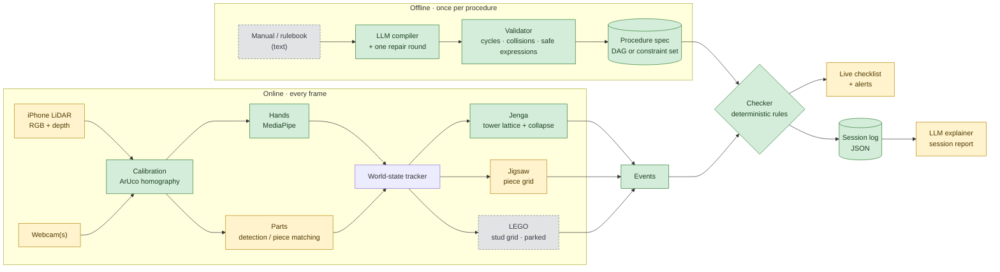

# STEPWISE

**Real-time detection of procedural errors from video, using task graphs an LLM compiles from the
written procedure.**

A person follows a procedure, like playing Jenga or doing a jigsaw, in front of a camera. STEPWISE
watches and raises an alert the moment they break it: a missed step, the wrong order, the wrong
part, a part in the wrong place, or an illegal move.

It splits the problem three ways:

- **Language (the thread):** an LLM reads the manual or rulebook *once, offline* and compiles it
  into a *procedure spec*: what must be true before each action is legal, and what each action
  should change.
- **Vision (the eyes):** CV models track hands and parts and keep a *world state* of what is
  physically on the table.
- **Checker (the judge):** a deterministic engine compares the observed state against the spec.
  Every alert comes from an explicit rule, never from the LLM.

The LLM never sees video. It works only with text.

---

## Current direction

| Procedure | Status | Why it is here |
| --- | --- | --- |
| **Jenga** | Active | No step order, only rules ("never take from the top complete layer"). Tests whether the spec format handles *constraints*, not just sequences. Blocks are all the same colour, so failures are reasoning failures, not detection failures. |
| **Jigsaw** | Active | A grid state, pieces identified by matching against the box picture (no detector training). Its instructions are written as ordered steps, so the ordered form of the spec stays demonstrated. |
| **LEGO** | Parked | Code and tests are kept. The original must-have demo, set aside for now in favour of the two above. |

> **Note:** `docs/` still describes the original LEGO-first plan and has not been updated for this
> change.

### Planned hardware

- **Jenga:** an iPhone Pro with LiDAR streaming colour + depth (via Record3D) from one diagonal
  corner of the tower, plus a second camera at the opposite corner. From a corner, every block's
  end is visible on one of the two faces, and the opposite camera covers hands and bodies
  blocking the view.
- **Jigsaw:** one overhead webcam looking down at a board with ArUco markers at the corners.

---

## Architecture



<sub>🟩 built · 🟨 to do · ⬜ parked / input.
"Parts" exists for LEGO (YOLO + ByteTrack) but not yet for jigsaw pieces or Jenga depth.</sub>

The world state is an **interface** (`stepwise/state/base.py`) with one implementation per
procedure. The checker holds a `WorldState` and never asks which kind it has, so adding a
procedure means adding a state tracker. The checker and the compiler stay the same.

### Two spec forms

| Form | Used for | Shape |
| --- | --- | --- |
| **DAG** (`DagSpec`) | Ordered procedures: LEGO, jigsaw steps | Steps with parts, poses and dependencies |
| **Constraints** (`ConstraintSpec`) | Rule-based procedures: Jenga | Actions with preconditions over the current state |

Both are lowered to the same list of actions with preconditions, so the checker has a single
code path. Preconditions are small expressions (`src.layer < top_layer`) checked against a
whitelist when the spec is compiled, and evaluated by an AST visitor. There is no `eval`
anywhere.

---

## Quick start

Requires Python 3.11+.

```bash
uv venv && source .venv/bin/activate
uv pip install -e ".[dev]"          # core + tests
uv pip install -e ".[live]"         # camera path: torch, ultralytics, mediapipe
uv pip install -e ".[llm]"          # compiler: anthropic SDK
./scripts/fetch_models.sh           # MediaPipe hand model into models/
```

### Run the tests

```bash
pytest                              # 229 tests, under a second, no hardware needed
```

### Replay a scripted session (no hardware)

A scenario script describes the *scene* over time: what is on the table, whether a hand is over
it, which block was pulled. The replayer feeds it frame by frame through the real tracker and
checker.

```bash
python -m stepwise.replay scripts/scenarios/jenga_fouls.yaml
# jenga_game: 6 moves judged, 6 alerts, 0 warnings
#   ended: game_over

python -m stepwise.replay scripts/scenarios/model_a_swap.yaml --log out.json
# model_a_house: 11/12 steps done, 1 alerts, 0 warnings
```

`scripts/make_scenarios.py` generates one scenario per planted error from a DAG spec.

### Compile a manual into a spec

```bash
export ANTHROPIC_API_KEY=...
python -m stepwise.compiler.compile manuals/model_a.txt --kind dag -o specs/model_a.compiled.json
```

The model is held to the spec's JSON schema, and the result then goes through the same
validator a hand-written spec does. If validation fails, the model gets one repair round with
the exact problems listed. If that fails too, the compiler stops and says why.

### Live camera (LEGO path, parked)

```bash
python scripts/make_markers.py markers.png      # print at 100%, tape at the plate corners
python -m stepwise.live --spec specs/model_a.json --zero-shot
python -m stepwise.live --spec specs/model_a.json --zero-shot --video run.mp4 --no-show --log run.json
```

---

## Repository layout

```
stepwise/
├── compiler/         schema.py · validate.py · expr.py (safe expressions) · compile.py (LLM)
├── perception/       calibrate.py (ArUco) · hands.py (MediaPipe) · detect.py (YOLO / YOLO-World) · pipeline.py
├── state/
│   ├── base.py       WorldState interface
│   ├── jenga/        lattice.py (18×3 tower) · collapse.py
│   └── lego/         grid.py (pixel → stud) · build_state.py          [parked]
├── checker/          engine.py · evaluate.py · match.py · rules_jenga.py · rules_lego.py
├── events.py         event + alert vocabulary shared by trackers and checker
├── session.py        joins a tracker and the checker for one run
├── sessionlog.py     JSON session log, the explainer's only input
├── replay.py         scripted sessions through the real pipeline
└── live.py           camera in, checklist + alerts out (OpenCV window)
specs/                compiled / hand-written procedure specs (JSON)
manuals/              text manuals and rulebooks
scripts/              markers, scenario generator, model fetch, scenarios/*.yaml
tests/                unit + scenario tests
docs/                 project plan and requirements spec (Markdown + PDF)
```

Empty and still to fill: `stepwise/temporal/` (step recognizer), `stepwise/explain/` (session
report), `stepwise/server/` (FastAPI + WebSocket), `ui/`, `eval/`, `configs/`.

---

## Roadmap

**Jenga**
- [ ] Stream RGB + depth from the iPhone (Record3D) into the perception pipeline
- [ ] Diagonal-corner mode for `lattice.py`: read two faces per camera and merge both views into one lattice
- [ ] Slot occupancy and pushed-block detection from depth
- [ ] Two-camera calibration into a shared tower frame
- [ ] Jenga rulebook text → compiled constraint spec
- [ ] Record and label real games

**Jigsaw**
- [ ] Jigsaw spec: grid, piece identities, ordered steps (corners → edges → interior) and rules
- [ ] Piece-grid state tracker (adapted from the stud grid)
- [ ] Piece identification and rotation by matching against the reference image
- [ ] Jigsaw manual text → compiled spec
- [ ] Record and label real runs

**Shared**
- [ ] Step recognizer (`temporal/`), benchmarked on Assembly101 / EgoPER
- [ ] LLM session report from the log (`explain/`)
- [ ] FastAPI + WebSocket server and web UI
- [ ] Evaluation scripts (`eval/`): error P/R per type, false alerts per run, alert delay, latency
- [ ] Update `docs/` to the current direction

**Later**
- [ ] Reading picture-only instructions (official LEGO booklets) with a vision model: step order
      and parts per step from the pages, positions from LDraw files or one demonstrated build

---

## Documentation

- [`docs/STEPWISE_Project_Plan.md`](docs/STEPWISE_Project_Plan.md): problem, architecture,
  timeline, risks
- [`docs/STEPWISE_Requirements.md`](docs/STEPWISE_Requirements.md): 255 numbered requirements
  (the `FR-*`, `NFR-*` and `IF-*` IDs cited in the code)
- [`docs/README.md`](docs/README.md): how the PDFs are built

Both documents describe the original LEGO-first plan.
