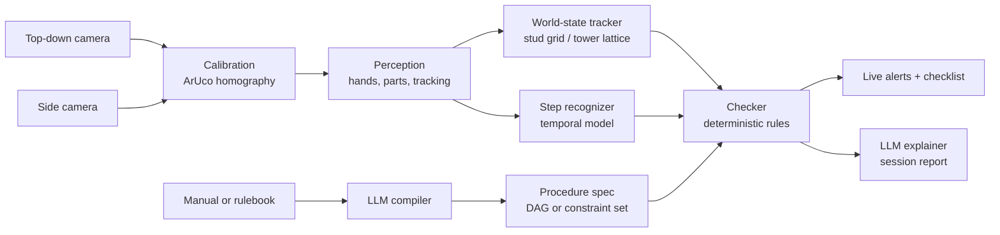

# STEPWISE: Real-Time Detection of Procedural Errors from Video Using LLM-Generated Task Graphs

*STEPWISE = Spatio-Temporal Error Perception With Instruction-Grounded Step Evaluation*

Plan as of 2026-09-18 · Live doc: https://claude.ai/artifact/PUVUABkr2Fb4Jnywgt3x7N

STEPWISE watches someone follow a procedure through a camera and flags missed, out-of-order or wrongly executed steps in real time. It uses a machine-readable procedure spec that an LLM compiles from any written source — an assembly manual or a rulebook.

Two demo procedures, chosen to be different in kind rather than different in decoration:

- **LEGO assembly** — an ordered manual compiles to a **dependency graph**. This is the must-have.
- **Jenga** — a rulebook compiles to a **constraint set** with no fixed order. This is the generality result.

---

## 1. Problem and goal

Most procedural errors are omissions or wrong order, not wrong motions, and usually nobody is watching when they happen. This is true in lab work, clinical routines like hand hygiene, and manual assembly lines.

Existing systems either classify single actions or need a custom model per task. STEPWISE separates the two concerns:

- **Language side (the thread):** an LLM reads a manual or rulebook and compiles it into a *procedure spec*: what must be true before an action is legal, and what each action should change in the scene.
- **Vision side (the eyes):** CV models track hands and parts, recognize which step is happening, and check the physical state against what the spec expects.
- **Checker (the judge):** a deterministic engine compares what the camera saw against the spec and raises alerts: *missed step*, *out of order*, *wrong part*, *wrong position*, *extra or removed part*, *illegal move*.

### 1.1 Why these two procedures

**LEGO** is the training and must-have demo:

- A LEGO manual is literally an ordered list of steps, which is exactly what a dependency graph needs.
- Errors are easy to stage and easy to see: wrong colour or size, skipped step, swapped order, brick on the wrong spot.
- Safe to show in college, costs little, and a camera on a stand is the whole setup.
- It matches public benchmarks: Assembly101 is toy-vehicle assembly with mistake labels.

**Jenga** is the generality demo, and it is deliberately awkward for our design in three useful ways:

- **The procedure has no step order.** The rulebook states invariants — never take from the top complete layer or above, finish a layer before starting the next, one hand at a time. The compiler must emit *preconditions on an action*, not a sequence. A system that only handles ordered manuals cannot do Jenga at all.
- **The state is vertical.** A 18x3 slot lattice, not a flat stud grid. This forces the state model to be an interface with two implementations rather than a hard-coded grid, and it is the reason the side camera moves into the core build (Section 2.2).
- **The part vocabulary is trivial.** One block class, uniform colour. So a failure on Jenga is unambiguously a *reasoning or state* failure, never a detection failure — which makes it a much cleaner test of the part of the system we actually claim as a contribution.

It is also the better live demo. A panel member plays a game and the system calls fouls in real time.

### 1.2 Generality claim, stated precisely

The earlier framing — "nothing is LEGO-specific except the object vocabulary" — was too strong. The object vocabulary is exactly the thing that costs labelled frames and a fine-tune, and the checker's pose matching is not vocabulary-parameterised. The honest claim is a ladder, and each rung is a separately reportable result:

| Tier | What is new | What is reused | Result it supports |
| --- | --- | --- | --- |
| 1 | LEGO Model B: unseen assembly, unseen manual | Same bricks, same detector, same graph form | Compiler + checker generalise across assemblies |
| 2 | Jenga tower **build**: unseen domain, new part vocabulary | Same graph form, same checker | Perception stack is retargetable |
| 3 | Jenga **game**: unseen procedure *topology* — constraints, not order | Same checker interface | The spec format, not just the weights, is general |

Tier 3 is the claim worth making. Tier 1 alone is weak and we should not oversell it.

**Goal for the semester:** a working real-time demo on LEGO assembly, a benchmark result on a public procedural-error dataset, a zero-shot result on an unseen LEGO model, and — if the must-have lands on schedule — live rule enforcement on Jenga.

---

## 2. System architecture

There is an offline path (the written procedure becomes a spec, once per procedure) and an online path (video becomes events and world state, continuously). The checker is where they meet.



The LLM never sees raw video. It works only with text: it compiles the procedure and explains the alerts. All visual judgment comes from CV models, and every alert comes from an explicit rule.

### 2.1 LLM procedure compiler (offline)

Two compilation targets, one output interface.

**Target A — dependency graph (LEGO).**

- **Input:** a text manual, one instruction per step (e.g. "Place a red 2x4 brick on the bottom-left corner, long side left-to-right").
- **Output:** JSON matching the schema in Section 4.2. Each step has the brick type, its target pose on the stud grid, dependencies and an expected duration.
- **Dependencies:** the LLM records both the stated order and physical dependencies (a brick cannot be placed on a brick that isn't there yet). The checker treats physical dependencies as hard and stated order as soft.

**Target B — constraint set (Jenga).**

- **Input:** the rulebook text.
- **Output:** a single `MOVE` action schema with preconditions and effects, plus terminal conditions (Section 4.3).
- The checker evaluates preconditions against the observed state on every detected move.

**The DAG is a special case of the constraint form.** Step *k*'s precondition is "all of `hard_depends_on` and `soft_depends_on` are done". We implement the constraint form as the checker's native interface and generate DAG preconditions from it, so both procedures run through identical code. This is a design contribution worth one paragraph in the report.

**Validation:** schema check, cycle check, collision check (two parts in the same cells), support check (nothing floating), and for constraint specs a satisfiability check (at least one legal move exists from the initial state). The user can fix the spec in the UI before running.

**Fallback, "teach by demonstration":** perform the procedure once correctly in front of the camera. The system records the state after each action and the LLM only names the steps. This is also how we get ground truth.

### 2.2 Calibration and cameras

- **Top-down camera** over the baseplate, with four printed **ArUco markers** at the plate corners. OpenCV detects them and computes a **homography** from image pixels to stud coordinates. Any detected brick lands on the stud grid, (x, y) in studs, whatever the angle.
- **Side camera(s).** Promoted from stretch goal to core build, for two independent reasons: LEGO layer inference is unreliable from top-down alone (Section 2.4), and Jenga is unobservable from top-down entirely.
- **Jenga rig:** two side cameras at 90 degrees, markers on the table around the tower base plus known block dimensions (75 x 25 x 15 mm) for scale. Each Jenga layer is perpendicular to exactly one of the two cameras, so every layer is seen end-on by one view and its gaps are directly visible. Two orthogonal views therefore give full observability of all 54 slots — worth stating explicitly because it is the reason the Jenga state is tractable at all.

### 2.3 Perception (online, per frame)

- **Hands:** MediaPipe Hands keypoints; hand-over-plate, grasp, and hand-count detection (the last one is a Jenga rule).
- **Parts:** a YOLO detector fine-tuned on our parts. LEGO classes are named by colour and size (`red_2x4`, `blue_2x2`, `yellow_1x4`, ...); Jenga is a single class, which is why it is cheap to add. YOLO-World zero-shot is the baseline and the fallback.
- **Tracking:** ByteTrack keeps part IDs stable so we know which part moved where.
- **Occlusion handling:** while a hand covers the workspace, the state is frozen and only updated once the hand leaves.

### 2.4 World-state tracker

An interface with two implementations. Both expose the same thing to the checker: a current state, and a diff against the previous state.

**LEGO — stud grid.**

- Keeps the model as a list of placed bricks: `(type, x, y, layer, rotation)`.
- A new brick counts as placed when it has sat still on the plate for N frames (about 0.5 s) after a hand leaves.
- **Layer (height).** Top-down cameras cannot see height directly. The original plan inferred it from occupancy — a brick whose footprint covers placed bricks sits one layer above the highest one below it. This is now rated a **high** risk, not medium, because it fails on partial overlap, on adjacent bricks whose boxes bleed together, and it cannot distinguish "on top of" from "beside, occluding at an angle". Worse, once a lower brick is covered it is never re-verified: it exists only in our state memory, so one bad inference silently corrupts everything above it for the rest of the run. Two mitigations, both now in the plan:
  - **Model A is designed nearly flat** (2 layers, mostly a mosaic), so the must-have demo never depends on layer inference.
  - **The side camera verifies height** for Model B (3-4 layers) and is the primary height signal once integrated in week 8.
- **State diff:** after each placement or removal, compare the new state to the previous one, giving an event such as `ADD red_2x4 @ (0,0,L0,rot0)` or `REMOVE blue_2x2 @ (4,2,L1)`.

**Jenga — tower lattice.**

- An 18 x 3 occupancy array plus per-layer orientation (alternating 90 degrees), derived from the two side views.
- Events are `REMOVE (layer, slot)` and `ADD (layer, slot)`, plus `COLLAPSE` as a terminal event (detected from a large single-frame drop in tower height, which is trivially separable from normal play and makes a good demo moment).
- No colour classification and no pose regression, so the state is far simpler than LEGO's. Failures here are attributable to the state logic, not the detector.

### 2.5 Step recognizer (online, per window)

**Scope decision:** this module is a **benchmark-only track**, time-boxed to two weeks (5 and 9). It is not on the live critical path for either demo. Rationale: for LEGO the state diff already determines what happened, and Section 4.7 concedes the model should predict generic verbs rather than step ids, so it contributes little the diff does not already give. Its jobs are (a) to produce the published-comparison table on a public dataset, and (b) one thing the state tracker genuinely cannot do, below.

- Clip-level features from a pretrained video encoder (VideoMAE or I3D) plus perception features (hand positions, part-in-hand, part counts).
- A temporal action segmentation model (MS-TCN++, ASFormer as the alternative) labels each moment: `search`, `grasp`, `place`, `adjust`, `remove`, `idle`, or a step id.
- **The one live job worth keeping:** the state tracker is frozen while hands occlude the workspace, so it is blind during exactly the interval in which the action happens. The temporal model is the *only* signal available during occlusion — it catches picking the wrong brick and hesitating, or a Jenga block being touched and released. The week-9 fusion hypothesis is therefore specific and testable: *the temporal model should recover errors that begin and end within an occlusion window*, and the ablation is designed around those cases rather than around overall accuracy.
- For the public benchmarks (Assembly101 / EgoPER) the step recognizer works alone, since those datasets have no stud grid.

### 2.6 Checker (online, rules)

Each step is `pending`, `active`, `done` or `error`. On every event the checker evaluates the preconditions of the matching action.

**LEGO error types**

- **Wrong brick:** a placed brick's type doesn't match any pending step at that pose.
- **Wrong position / rotation:** the brick type matches a pending step but the pose is off by at least one stud or 90 degrees.
- **Out of order:** a placement matches step *k*, but a step *j < k* that it softly depends on is still pending.
- **Missed step:** a required step is still pending when the session ends, or a soft-dependency violation implies a skip.
- **Extra / removed brick:** a placement matching no step, or the removal of a brick from a done step.

**Hard-dependency violations are not user errors.** The earlier draft raised a *missed step* alert when a step completed while a hard (physical support) dependency was still pending. That is inverted: if the dependency is physically necessary, then observing its violation means *our perception is wrong*, and alerting the user accuses them of a mistake they did not make. Hard-dep violations now route to an internal re-verification path (Section 4.4), never straight to the user.

**Jenga error types**

- **Illegal source layer:** a block removed from the top complete layer or above.
- **Layer started early:** a block placed on a new top layer while the layer below is incomplete.
- **Two-handed move:** both hands in contact during a removal.
- **Wrong replacement:** a block returned to a slot other than a legal top-layer slot.
- **Collapse:** terminal; the session ends and the report reconstructs the last few moves.

**Soft warnings:** events below a confidence threshold produce a yellow warning, not a red alert, to keep false alarms down. The false-alarm budget is now an explicit target (Section 7), not just an ablation.

### 2.7 Interface and explainer

- **Live view:** video with part boxes and grid or lattice overlay; a checklist that ticks off as steps are completed (LEGO) or a live legality panel (Jenga); red and yellow alerts; a "ghost" image of the next expected placement.
- **After the session:** the LLM turns the event log into a readable report (e.g. "At 01:42 you placed the blue 2x2 of step 7 before the yellow 1x4 of step 6; the roof would not have fit", or "At 03:10 you pulled from layer 16, one below the top complete layer — illegal").

---

## 3. Tech stack and models

Everything is Python and PyTorch with pretrained models; only small models are trained, so one consumer GPU or free Colab/Kaggle GPUs are enough.

| Module | Primary choice | Fallback / alternative | What we train |
| --- | --- | --- | --- |
| Calibration | OpenCV ArUco + homography | Manual 4-corner click | Nothing |
| Hands | MediaPipe Hands | MMPose hand models | Nothing |
| Part detection | YOLO (Ultralytics) fine-tuned | YOLO-World zero-shot | Yes: 300-600 labelled frames LEGO, ~150 Jenga |
| Tracking | ByteTrack | SORT | Nothing |
| World state | Our own grid / lattice modules (NumPy) | - | Nothing |
| Video features | VideoMAE or I3D (precomputed) | DINOv2 per-frame features | Nothing |
| Step segmentation | MS-TCN++ | ASFormer | Yes, main temporal model |
| LLM (compiler, explainer) | Claude Sonnet 5 via API | Local Qwen or Llama via Ollama | Nothing; prompt + JSON schema |
| Checker | Plain Python state machine | - | Nothing |
| Backend | FastAPI + WebSocket streaming | - | - |
| Frontend | React | Streamlit for early versions | - |
| Labelling | CVAT (boxes, step segments) | Label Studio | - |
| Experiment tracking | Weights & Biases | TensorBoard | - |

### 3.1 Latency budget

The earlier plan asserted 15+ FPS without allocating any of it. Per-frame budget at a 15 FPS target (66 ms/frame), measured on the demo laptop in week 6:

| Stage | Cadence | Budget |
| --- | --- | --- |
| YOLO (n or s, 640 px) | every frame | 15-25 ms |
| MediaPipe Hands | every frame | 5-10 ms |
| ByteTrack | every frame | < 2 ms |
| Homography refresh | every 10 frames | < 1 ms amortised |
| State update + diff | on hand-exit | < 1 ms |
| Checker | per event | < 1 ms |
| **Per-frame total** | | **<= 40 ms (leaves 26 ms headroom)** |
| Temporal model | every 0.5 s, async | <= 200 ms, off the critical path |
| WebSocket overlay push | every frame | <= 10 ms |

**Two consequences.** The temporal model runs asynchronously and never blocks a frame. And the demo reads the camera **locally in the Python process**, pushing only overlays and alerts over the WebSocket — the earlier browser-sends-frames design put encode, transport and decode on the critical path for no benefit. Browser capture stays available for remote use, but it is not the demo path.

**Hardware:** 1080p webcam or phone on a top-down stand, plus one or two side cameras; a 16x16 or 32x32 baseplate with 4 printed ArUco markers; a Jenga set and a dark backdrop; a plain mat, even lighting, and a laptop with a GPU (or a remote GPU for inference).

---

## 4. Implementation details

### 4.1 Repository structure

```
stepwise/
├── configs/                 # YAML configs per procedure/dataset/experiment
├── manuals/                 # text sources: model_a.txt, model_b.txt, jenga_rules.txt
│   └── eval_corpus/         # 15-20 hand-written manuals + ground-truth specs
├── specs/                   # compiled + validated JSON procedure specs
├── stepwise/
│   ├── compiler/
│   │   ├── schema.py        # Pydantic models: DAG form and constraint form
│   │   ├── compile.py       # manual/rulebook -> LLM -> JSON
│   │   ├── validate.py      # cycles, collisions, support, satisfiability, schema
│   │   └── from_demo.py     # teach-by-demonstration fallback
│   ├── perception/
│   │   ├── calibrate.py     # ArUco detection + homography (top + side)
│   │   ├── hands.py         # MediaPipe wrapper
│   │   ├── detect.py        # YOLO part detector
│   │   └── track.py         # ByteTrack wrapper
│   ├── state/
│   │   ├── base.py          # WorldState interface: current(), diff()
│   │   ├── lego/
│   │   │   ├── grid.py      # pixel -> stud mapping, footprints, rotation
│   │   │   ├── build_state.py
│   │   │   └── height.py    # occupancy inference + side-camera verification
│   │   └── jenga/
│   │       ├── lattice.py   # 18x3 occupancy from two side views
│   │       └── collapse.py  # terminal-event detection
│   ├── temporal/
│   │   ├── features.py      # video + perception feature extraction
│   │   ├── mstcn.py         # MS-TCN++ model
│   │   ├── train.py
│   │   └── smooth.py        # frame labels -> step events
│   ├── checker/
│   │   ├── engine.py        # precondition evaluator (constraint-native)
│   │   ├── rules_lego.py
│   │   └── rules_jenga.py
│   ├── explain/
│   │   └── report.py        # event log -> LLM session report
│   └── server/
│       ├── app.py           # FastAPI app
│       └── stream.py        # WebSocket: overlays + alerts out
├── ui/                      # React app
├── eval/
│   ├── metrics.py           # seg metrics, error P/R/F1, delay, false-alarm rate
│   ├── run_benchmark.py     # Assembly101 / EgoPER
│   ├── run_compiler.py      # compiler accuracy over the eval corpus
│   ├── run_lego.py
│   └── run_jenga.py
├── scripts/                 # recording, labelling export, synthetic renders
└── tests/                   # unit tests for grid, lattice, diff, checker rules
```

### 4.2 Procedure spec — dependency form (LEGO)

```json
{
  "procedure": "model_a_house",
  "kind": "dag",
  "state_model": "stud_grid",
  "baseplate": { "studs_x": 16, "studs_y": 16 },
  "steps": [
    {
      "id": "s1",
      "instruction": "Place a red 2x4 brick on the bottom-left corner, long side left-to-right",
      "part": { "color": "red", "size": "2x4" },
      "pose": { "x": 0, "y": 0, "layer": 0, "rot": 0 },
      "hard_depends_on": [],
      "soft_depends_on": [],
      "optional": false,
      "expected_duration_s": [3, 20]
    },
    {
      "id": "s2",
      "instruction": "Place a blue 2x2 brick on top of the right half of the red brick",
      "part": { "color": "blue", "size": "2x2" },
      "pose": { "x": 2, "y": 0, "layer": 1, "rot": 0 },
      "hard_depends_on": ["s1"],
      "soft_depends_on": ["s1"],
      "optional": false,
      "expected_duration_s": [3, 20]
    }
  ]
}
```

- `hard_depends_on`: physically required (support). A violation is physically impossible, so it signals a **detection failure on our side**, not a user error. See Section 4.4.
- `soft_depends_on`: order stated in the manual. Violating it is an **out-of-order** error.

### 4.3 Procedure spec — constraint form (Jenga)

The rulebook has no steps, so the compiler emits actions with preconditions. The checker's evaluator is written against this form; DAG steps are lowered into it.

```json
{
  "procedure": "jenga_game",
  "kind": "constraints",
  "state_model": "tower_lattice",
  "tower": { "layers": 18, "slots_per_layer": 3 },
  "actions": [
    {
      "id": "move",
      "instruction": "Take one block from below the top complete layer and place it on top",
      "preconditions": [
        { "id": "c1", "expr": "src.layer <= top_complete_layer - 1",
          "text": "Do not take from the top complete layer or above",
          "violation": "illegal_source_layer" },
        { "id": "c2", "expr": "hands_in_contact == 1",
          "text": "One hand at a time",
          "violation": "two_handed_move" },
        { "id": "c3", "expr": "dst.layer == top_layer or layer_complete(top_layer)",
          "text": "Finish a layer before starting the next",
          "violation": "layer_started_early" },
        { "id": "c4", "expr": "dst in legal_top_slots()",
          "text": "Place only in a top-layer slot",
          "violation": "wrong_replacement" }
      ],
      "effects": ["occupancy[src] = 0", "occupancy[dst] = 1"]
    }
  ],
  "terminal": [
    { "id": "t1", "expr": "collapse_detected", "outcome": "game_over" }
  ]
}
```

The `expr` strings are evaluated by a small safe interpreter over named state predicates, not by `eval`. The LLM chooses among a fixed predicate vocabulary given in the prompt, which keeps the output checkable.

### 4.4 Events and the checker loop

```python
Event = {
    "t": 102.4,                  # seconds since session start
    "source": "state" | "temporal",
    "kind": "ADD" | "REMOVE" | "STEP_START" | "STEP_END",
    "part": {"color": "blue", "size": "2x2"},
    "pose": {"x": 2, "y": 0, "layer": 1, "rot": 0},
    "confidence": 0.91,
}

def on_event(ev, spec, status, state, alerts):
    if ev["kind"] == "ADD":
        step = match_step(ev, spec, status)            # same type + pose, still pending
        if step is None:
            near = match_type_only(ev, spec, status)
            alerts.add(wrong_position(ev, near) if near else wrong_or_extra_part(ev))
            return

        # Hard deps are physically necessary. A violation means OUR state is wrong,
        # not that the user erred. Never alert here -- re-verify instead.
        unmet_hard = [d for d in step.hard_depends_on if status[d] != "done"]
        if unmet_hard:
            state.request_reverify(unmet_hard)         # forced re-read once hands clear
            return                                     # decision deferred, no alert

        for dep in step.soft_depends_on:
            if status[dep] != "done":
                alerts.add(out_of_order(step, dep, ev))
        status[step.id] = "done"

    elif ev["kind"] == "REMOVE":
        step = step_at_pose(ev, spec, status)
        if step and status[step.id] == "done":
            status[step.id] = "pending"
            alerts.add(removed_part(step, ev))

def on_reverify(deps, observed, status, alerts, log):
    """Resolves a deferred hard-dependency conflict once the view is clear."""
    for d in deps:
        if observed.supports(d):
            status[d] = "done"                  # the part was there; we missed it
            log.perception_miss(d)              # counted against detector recall, not the user
        else:
            alerts.add(missed_step(d))          # genuinely absent: a real skip
```

At the end of a session, every non-optional step still `pending` becomes a **missed step** alert. Perception misses recorded by `on_reverify` are reported separately in the evaluation as a detector recall failure — they are our error, and counting them honestly is part of the results.

### 4.5 Real-time loop

1. The demo process reads the camera(s) directly at 15-30 FPS. (Browser capture remains available for remote use but is not the demo path.)
2. Every frame: YOLO parts + MediaPipe hands + ByteTrack.
3. Every 10 frames or when the markers move: recompute the homographies.
4. When no hand is over the workspace for about 0.5 s: update the world state, diff to events, run the checker.
5. Every 0.5 s, asynchronously: the temporal model runs on the last few seconds of features, producing step events for the checker. It never blocks a frame.
6. Server pushes overlays, checklist or legality status and alerts over the WebSocket.
7. At session end (or on `COLLAPSE`): the event log goes to the LLM explainer.

### 4.6 Training the part detector

- **LEGO:** record short clips of each brick type on the plate, in hands and partly covered; sample 300-600 frames; label boxes in CVAT. Train YOLO (small/nano) at 640 px; check per-class precision/recall, especially similar colours (red vs orange) and sizes (2x3 vs 2x4).
- **Jenga:** one class, high contrast against a dark backdrop, rigid rectilinear geometry. ~150 frames is expected to suffice; this is why Jenga is cheap to add.
- Optional: synthetic data rendered from LDraw brick models in Blender (random poses, lighting, backgrounds). Strong addition for the report, but a stretch goal.

### 4.7 Training the step recognizer

- Precompute features once per video (VideoMAE/I3D) and store as `.npy`, so training runs fast even on a free GPU.
- Train MS-TCN++ on Assembly101 (or EgoPER) for the benchmark, then fine-tune on STEPWISE-LEGO Model A.
- Use generic action classes (`grasp`, `place`, `adjust`, `remove`, `idle`) rather than step ids, so the same model transfers to Model B and to Jenga without retraining. The world-state tracker supplies which step it was.

---

## 5. Datasets

A public dataset gives the benchmark numbers; our own recordings give the demos and the generality results. *Check each public dataset's access, license and size in week 1; the descriptions below are from memory and are unverified.*

| Dataset | What it contains | Use in STEPWISE |
| --- | --- | --- |
| Assembly101 | Toy-vehicle assembly and disassembly from multiple views, with fine-grained action and mistake labels | **Primary benchmark** - same domain as our demo |
| EgoPER | First-person cooking videos with step labels and deliberate errors | Second benchmark for error detection |
| IndustReal | Assembly of a toy car model, with procedure step and error labels | Stretch: extra assembly benchmark |
| Public LEGO brick image sets (e.g. on Kaggle) | Images of individual LEGO bricks by type | Optional extra data for the detector |
| **STEPWISE-LEGO (ours)** | Two custom LEGO models, with planted errors | Training, live demo, zero-shot test |
| **STEPWISE-JENGA (ours)** | Jenga games with planted rule violations | Generality demo and tier-3 result |
| **Compiler eval corpus (ours)** | 15-20 written manuals + hand-authored ground-truth specs | Compiler accuracy, Section 7 |

### 5.1 STEPWISE-LEGO

- **Models:** Model A (a small house, 12-15 steps, **designed nearly flat at 2 layers** so the must-have does not depend on height inference) and Model B (a car or tower, 10-12 steps, 3-4 layers, used to stress the side camera), built from the same set of about 8-10 brick types in distinct colours and sizes. Standard bricks (2x2, 2x4, 1x4, 1x2), not tiny pieces.
- **Recordings:** 4-6 people. Model A: 40-60 runs, about half with planted errors. Model B: 15-20 runs, **used only for testing**.
- **Recording starts in week 4**, not week 7. Runs accumulate from the moment the build-state tracker exists — we need footage for debugging anyway, and it turns week 7 from a cliff into a top-up.
- **Planted errors:** skip a step, swap two steps, wrong colour, wrong size, off-by-one-stud position, rotated 90 degrees, extra brick, remove a placed brick.
- **Labels:** step start/end times and error type per run (CVAT or ELAN); final state per step (from teach-by-demonstration); boxes on 300-600 frames.
- **Labelling budget: 30 person-hours**, not 15. The earlier estimate was roughly 2x optimistic for 55-80 runs of step boundaries plus error type plus boxes.

### 5.2 STEPWISE-JENGA

- 15-20 games, 3-4 people, two orthogonal side views.
- **Planted violations:** pull from the top complete layer, start a new layer early, two-handed pull, return a block to an illegal slot. Plus naturally occurring collapses, which need no planting.
- Labels: move start/end, source and destination slot, violation type. Much cheaper to label than LEGO — a move is a short, visually distinct event and there is no part vocabulary to annotate. Budget 8 person-hours.

### 5.3 Compiler eval corpus

Fifteen to twenty short manuals for models we **never physically build**, each with a hand-authored ground-truth spec. Pure text, a few hours of work in week 2 while the two real manuals are being written, no bricks and no recording.

This exists because the earlier plan targeted "compiler step/pose/dependency accuracy >= 0.9" while compiling exactly two manuals in the entire project. N=2 is not a measurement. The corpus turns that target into a real table with an error taxonomy (wrong pose, missed dependency, hallucinated step, wrong constraint) — and it is the one result that survives independently of whether the vision stack works. Include 3-4 rulebook-style sources so the constraint form is measured too.

---

## 6. Scope

The minimum project is one fixed top-down camera, LEGO Model A, catching missed, out-of-order and wrong-brick errors live. Everything else is added only once that works end to end.

### Must have (minimum viable project)

- LLM compiles a text manual into a validated dependency spec.
- ArUco calibration, brick detection, tracking and the world-state tracker.
- Checker detects **missed step**, **out of order** and **wrong brick**.
- Live demo: camera in, checklist and alerts out, at 15+ FPS within the Section 3.1 budget.
- Step recognizer trained and benchmarked on Assembly101 or EgoPER against at least one baseline.
- Compiler accuracy measured on the eval corpus.

### Should have (in priority order)

1. **Side camera** integrated for height verification. Everything below depends on it.
2. **Wrong position / rotation** and **extra / removed brick** alerts.
3. **Zero-shot on LEGO Model B** from its manual only (tier 1).
4. **Jenga tower build** — new part vocabulary, same graph form (tier 2).
5. **Jenga game with the constraint compiler** (tier 3) — the strongest result in the project and the best live demo. Gated on a week-9 go/no-go against must-have status.
6. LLM session report; spec editor in the UI; ghost overlay of the next placement.

### Stretch goals

- Synthetic training data from LDraw + Blender renders.
- Runs on a laptop CPU or a Jetson for edge deployment; voice alerts.
- ~~VLM reads picture-only official LEGO instruction pages~~ — **demoted**. It is a separate research problem with its own failure modes, and Jenga now carries the generality claim more convincingly for less work. Revisit only if weeks 12-13 are clear.

### Out of scope

- Tiny pieces (1x1 plates, Technic pins), hinged or angled parts.
- Several people building at once; head-mounted (moving) camera for our own data.
- Jenga stability or lean estimation — we check rule legality, not physics.

---

## 7. Evaluation

We measure each stage separately so failures are attributable.

| Question | Metric | Target |
| --- | --- | --- |
| Are parts detected where they are? | **Median and p95 centroid error in studs**; mAP@0.5 secondary | Median <= 0.4 stud, p95 <= 1.0 stud |
| Is the world state right? | Placement accuracy (type + pose exact) per step | 90%+ on Model A; 85%+ on Model B |
| Is the Jenga lattice right? | Slot occupancy accuracy vs hand-labelled state | 95%+ (one class, no pose regression) |
| Are steps recognized? | Frame accuracy, Edit score, F1@{10, 25, 50} | Within reach of published numbers |
| Are errors caught? | **Precision at fixed recall**, per error type | **Precision >= 0.8 at recall >= 0.8** on Model A; **>= 0.7 at 0.7** on Model B |
| Is it quiet when nothing is wrong? | **False alerts per correct build** | **<= 1.0** on Model A |
| How early? | Median delay from error to alert | Under 2 s |
| Is it usable live? | Per-stage latency against the Section 3.1 budget | 15+ FPS, per-frame <= 40 ms |
| Is the compiler right? | Step, pose, dependency and constraint accuracy over the **eval corpus (n=15-20)** | 0.9+ on steps, 0.8+ on dependencies |
| Do Jenga rules hold? | Violation P/R per rule; collapse detection | Precision >= 0.8 at recall >= 0.8 |

**On the two changed targets.** `mAP@0.5` was the wrong detector metric: IoU 0.5 on a 2x4 brick is roughly a full stud of slack, so a "passing" detection can still trigger a wrong-position alert. Centroid error in studs measures the thing the checker actually consumes. And recall targets without a paired precision target are gameable — a system that alerts constantly scores recall 1.0. The false-alerts-per-correct-build number is what a panel member actually experiences in a live demo.

### Baselines

- **Temporal model only:** no world-state tracker; errors decided from recognized actions alone.
- **End-to-end VLM:** sampled frames plus the manual, asked to list errors. **We do not predict the outcome in advance.** It may well beat us on *missed step* while losing badly on position and timing, and that split is a more interesting result than a strawman. Report it as measured.
- **Published results** from the benchmark dataset's paper.

### Ablations

- Without the world-state tracker (actions only), and without the temporal model (state only).
- **Occlusion-window slice:** errors that begin and end while hands occlude the workspace, state-only vs fused. This is the specific hypothesis from Section 2.5 and the only place the temporal model should win.
- LLM-generated spec vs hand-written spec.
- Zero-shot YOLO-World vs fine-tuned YOLO.
- With vs without soft warnings (false-alarm rate).
- Top-down only vs top-down + side camera, on Model B height accuracy.
- Tier 1 vs tier 2 vs tier 3 generality (Section 1.2).

---

## 8. Timeline (14 weeks)

A crude end-to-end pipeline runs by week 6; everything after that improves it. **Week 13 is reserved slack and is not allocated to features.** Adjust weeks to the course's review dates.

| Week | Milestone | Done when |
| --- | --- | --- |
| 1 | Literature review; request dataset access; buy bricks, baseplate, Jenga set, cameras; **decide the LLM API question** (~20 calls total, so cost is a rounding error — just settle it) | 1-page related-work summary; datasets downloading; hardware in hand; API decided |
| 2 | Design Model A (flat, 2 layers) and Model B; write both manuals; spec schema (DAG + constraint); compiler v1 + validator; **write the 15-20 manual eval corpus** | Valid specs for both models; corpus committed |
| 3 | Camera stand, ArUco baseplate, top-down calibration; record brick clips; label 300+ frames; YOLO v1 | Bricks detected and mapped to studs live |
| 4 | Tracking + build-state tracker + diff; teach-by-demo recorder; **start recording Model A runs continuously from here** | Correct build state live for Model A; first runs banked |
| 5 | Checker v1 (missed, out-of-order, wrong brick); precompute benchmark features; MS-TCN++ baseline *(temporal box 1 of 2)* | Live alerts on Model A; first benchmark numbers |
| 6 | **End-to-end v0:** camera → perception → state → checker → alerts. Measure the latency budget. | Rough live demo; budget table filled; mid-term review |
| 7 | Top up STEPWISE-LEGO recording; Model B test runs; compiler accuracy run over the corpus | All runs recorded; compiler table done |
| 8 | Label STEPWISE-LEGO; more detector labels; YOLO v2; **side camera integration + height verification** | Labels exported; splits fixed; Model B heights correct |
| 9 | Fine-tune temporal model; occlusion-window fusion *(temporal box 2 of 2)*. **Jenga go/no-go gate.** If green: Jenga rig, detector, lattice state | Fusion measured on the occlusion slice; Jenga state live or formally deferred |
| 10 | Remaining LEGO rules (position, rotation, extra/removed); soft warnings; LLM report; Jenga constraint compiler + checker | All must-have and should-have 1-3 in; Jenga rules firing |
| 11 | Full evaluation: benchmark, Model A, Model B, Jenga, baselines, ablations, latency | Results tables complete |
| 12 | UI polish: checklist, alerts, ghost overlay, spec editor; Jenga legality panel; record demo video | Someone outside the team can use it |
| 13 | **Reserved slack.** Absorbs overruns from any earlier week. Only if genuinely clear: stretch goals | Stable build |
| 14 | Report, poster, demo video, final presentation | Submitted |

**Dependency note:** weeks 9-11 previously depended on data that only arrived in week 8, with no buffer anywhere. Incremental recording from week 4 and a reserved week 13 are the two changes that fix this.

---

## 9. Work split

One owner per module; everyone shares recording and labelling. With 3 people, merge the Perception and App roles.

| Role | Owns | Key outputs |
| --- | --- | --- |
| Perception lead | Calibration (top + side), part detector, hands, tracking, both world-state trackers | Stud-accurate state at 15+ FPS; Jenga lattice |
| Temporal model lead | Video features, MS-TCN++ / ASFormer, benchmark and eval scripts | Step recognition results; ablation tables |
| Reasoning lead | Spec schemas, LLM compiler + validator, checker engine and both rule sets, explainer, compiler eval corpus | Valid specs; error-detection results; tier 1-3 generality table |
| App lead | FastAPI streaming backend, React UI, integration, latency budget, demo video | Live demo; UI; final video |

**Everyone:** recording (weeks 4-7), labelling (week 8), and writing the report (week 14).

---

## 10. Risks and fallbacks

| Risk | Likelihood | Fallback |
| --- | --- | --- |
| **Height/layer wrong from top-down view** | **High** *(raised from Medium)* | Model A designed flat so the must-have never depends on it; side camera integrated in week 8 as the primary height signal |
| Similar bricks confused (red/orange, 2x3/2x4) | High | Brick set with clearly distinct colours and sizes; more labels; synthetic renders |
| Hands block the view during placement | High | Update state only after the hand leaves; stability filter; temporal model covers the occlusion window |
| Labelling takes longer than planned | High | Budget raised to 30 h; step boundaries only; states from teach-by-demonstration |
| Jenga scope creep sinks the must-have | Medium | Formal go/no-go gate in week 9; Jenga is should-have 4-5, never must-have |
| Jenga far-side blocks unobservable | Medium | Two orthogonal side cameras: every layer is end-on to exactly one view |
| Step recognition too inaccurate | Medium | It is a benchmark-only track; LEGO demo relies on state diffs; report honest numbers |
| Too many false alarms | Medium | Soft warnings; require stable state; explicit false-alerts-per-build target |
| Dataset access slow or denied | Medium | Switch among Assembly101, EgoPER, IndustReal; our own data alone carries the demo |
| Not enough GPU | Medium | Precompute features; small YOLO variant; Colab/Kaggle for training |
| LLM specs wrong | Low | Validator + one repair round; teach-by-demonstration; manual editor; measured on the eval corpus |
| Jenga tower collapses mid-run | Certain | Treated as a terminal event, not a failure — auto-save the clip; it is a demo highlight |

---

## 11. Deliverables and demo

- **Code:** public GitHub repo with setup instructions, trained weights and evaluation scripts.
- **Dataset:** STEPWISE-LEGO and STEPWISE-JENGA videos, specs and labels, released if everyone recorded agrees. The compiler eval corpus is text-only and can be released unconditionally.
- **Report:** written like a short paper: problem, related work, method, results, ablations, the tier 1-3 generality table, limitations.
- **Demo video (2-3 min):** a correct build of Model A with the checklist ticking off; each error type caught live; Model B from its manual alone; then a Jenga game with rule violations called in real time.
- **Live demo at college:** baseplate, cameras, a box of bricks, and a Jenga tower. A panel member builds Model B and tries to trick the system by skipping or swapping steps, then plays Jenga and tries to cheat. The Jenga half is the one people will remember — it is adversarial, fast, and the failure mode (a collapse) is entertaining rather than embarrassing.
- **Stretch:** submit to a student research track or a CVPR/ICCV workshop on egocentric or procedural video.

---

## 12. Open questions

- [ ] Team size: 3 or 4?
- [ ] Which bricks do we have, or should we buy (a classic brick box with many 2x2 / 2x4 bricks in distinct colours)?
- [ ] Designs for Model A (flat, 2 layers) and Model B (3-4 layers).
- [ ] What GPU do we have: local card, college lab, or Colab/Kaggle only?
- [ ] Course review dates, to line up the timeline and the week-9 Jenga gate.
- [ ] How many cameras can we actually mount and sync? (2 minimum for Jenga, 3 ideal overall.)
- [x] ~~Is an LLM API allowed or budgeted?~~ → resolve in week 1; volume is ~20 calls, cost negligible, Ollama fallback exists.
